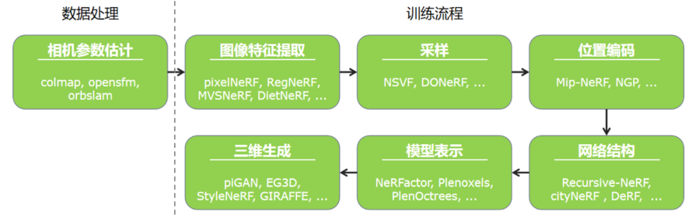
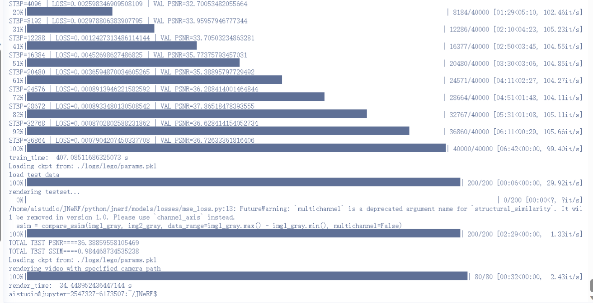

&nbsp;
**
计算机图形学项目报告
**
&nbsp;

Project3 【神经辐射场(NeRF)实践】 

&nbsp;&nbsp;
&nbsp;&nbsp;

&nbsp;&nbsp;&nbsp;&nbsp;

&nbsp;

学生姓名：<u>叶兴松</u> 
    &nbsp&nbsp
学生姓名：<u>秦铮</u> 

&nbsp;

学&ensp;号：<u>20307130227</u> &ensp;
学&ensp;号：<u>20307130169</u> &ensp;

&nbsp;

专&ensp;业：<u>计算机科学与技术</u> &ensp;
专&ensp;业：<u>计算机科学与技术</u> &ensp;

&nbsp;

日&ensp;&ensp;期：<u>2023/06/xx</u>

### 一、基础部分：使用NeRF进行身边物体的重建

#### 概述

#### 所选方法介绍

##### Nerf方法：Instant-NGP

##### Nerf框架：JNeRF

JNeRF是由清华大学计算机图形学实验室基于自身计图(Jittor)框架开发的神经辐射场算法库，并在其中成功复现了Instant-NGP，故我们选取JNeRF作为我们的baseline用于身边物体的重建。

当前NeRF的主要训练流程总结为下图所示的7个模块。JNeRF框架集成度较高，仅需对数据处理做外部操作，训练流程则在内部一体化完成。

Instant-NGP通过Hash编码和定制化的优化，其号称能在5秒训练出一个效果优质的结果。但经过JNeRF团队的分析，Instant-NGP的表现更可能是因为Nvidia针对硬件做了极致优化。同时，Instant-NGP的原始实现仍存在一些问题：

- 源码完全基于cuda编写，对习惯python的用户而言使用门槛较高，并且不同函数间耦合严重，难以修改。

- Instant-NGP没有成熟的深度学习框架支持，无法适配各种常用NeRF变种模型

- 环境搭建和本机编译困难，在自己的电脑和云上平台都上难以复现

基于以上问题，我们采用JNeRF实现的Instant-NGP，其优势有：

- 对现有的数据集（lego、fox）等做了完美的适配，方便我们直接通过数据对齐的方式制作我们的数据集，得到想要的训练和测试效果

- 环境配置方便，仅需下载`requirements.txt`中所需的库即可运行样例代码

- 训练和测试速度高效、效果优异。在飞浆AI平台提供的V100显卡上训练lego（100张训练集，主要超参设置为batch_size=4096、tot_train_steps = 40000、n_training_steps = 16）仅需约400s，且测试集的PSNR达到了36，SSIM达到0.98（如下图所示）

  

  
  渲染效果：
  
  

    

#### 数据介绍

#### 结果展示与评估

##### 主观结果展示

  
  
  

##### 数值评估

|   超参/评估值    | ikun      | bear      | seg_bear  | lego      |
| :--------------: | --------- | --------- | --------- | --------- |
|    batch_size    | 4096      | 4096      | 4096      | 4096      |
| tot_train_steps  | 8192      | 40000     | 10000     | 40000     |
| n_training_steps | 16        | 16        | 16        | 16        |
| background_color | [0, 0, 0] | [0, 0, 0] | [0, 0, 0] | [0, 0, 0] |
|     **PSNR**     | 28.22     | 28.00     | 31.23     | 36.39     |
|     **SSIM**     | 0.92      | 0.91      | 0.94      | 0.98      |

##### 训练/渲染时间

| 数据量\时间   | ikun  | bear  | seg_bear |
| ------------- | ----- | ----- | -------- |
| 训练集（张）  | 44    | 60    | 60       |
| 训练时间（s） | 109.2 | 514.6 | 191.0    |
| 渲染时间（s） | 44.6  | 67.1  | 86.2     |

##### 运行结果截图

### 二、扩展部分：NeRF探索性研究

### 文件说明

### 参考

1. [Jittor/JNeRF(github.com)](https://github.com/Jittor/JNeRF)
2. [Jittor开源: JNeRF带你5秒训好NeRF](https://cg.cs.tsinghua.edu.cn/jittor/news/2022-06-01-12-52-00-00-jnerf/)

