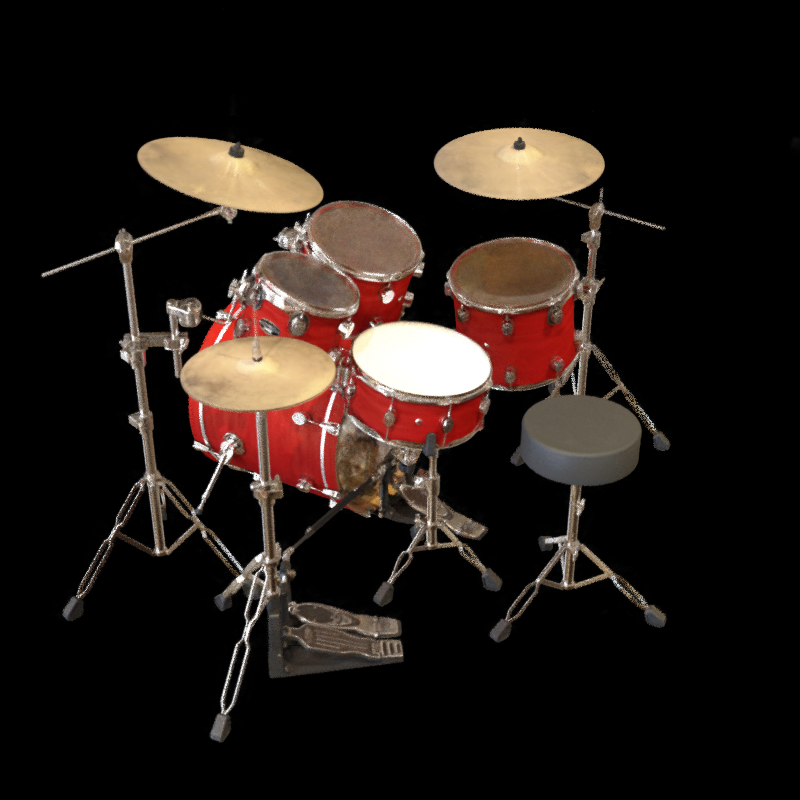

<font face="宋体">

&nbsp;
**<font size=12><p align="center">计算机图形学项目报告</p></font>**
&nbsp;
<font size=6><p align="center">Project3 【神经辐射场(NeRF)实践】 </p></font>
&nbsp;&nbsp;
&nbsp;&nbsp;

<div align=center></div>

&nbsp;&nbsp;&nbsp;&nbsp;
<font size=2>

&nbsp;
<center>
学生姓名：<u>叶兴松</u> 
    &nbsp&nbsp
学生姓名：<u>秦铮</u> 
    &nbsp&nbsp
学生姓名：<u>蔡哲飙</u> 
    &nbsp&nbsp
学生姓名：<u>段钧文</u> 
</center>

&nbsp;
<center>
学&ensp;号：<u>20307130227</u> &ensp;
学&ensp;号：<u>20307130169</u> &ensp;
学&ensp;号：<u>20307130001</u> &ensp;
学&ensp;号：<u>20307130235</u> &ensp;
</center>

&nbsp;
<center>
<font size="1.8">专&ensp;业：<u>计算机科学与技术</u> &ensp;</font>
<font size="1.8">专&ensp;业：<u>计算机科学与技术</u> &ensp;</font>
<font size="1.8">专&ensp;业：<u>计算机科学与技术</u> &ensp;</font>
<font size="1.8">专&ensp;业：<u>计算机科学与技术</u> &ensp;</font>
</center>


&nbsp;
<center>
日&ensp;&ensp;期：<u>2023/06/04</u>
</center>
</font>

## 一、基础部分：使用NeRF进行身边物体的重建

### 概述

在前期baseline的选取上，我们每位成员都对具体的一个代码仓库进行尝试，以选出适配性好、功能性强的基础代码。最终，为了完成本次NeRF重建的任务，我们选取Instant-NGP作为重建方法。同时，我们使用百度飞桨AI平台来搭建环境，配置参数为（GPU：16G V100）。由于远程平台不支持实时渲染GUI的展示，以及Instant-NGP在该平台上的配置冲突，我们选用两套代码来进行重建：Instant-NGP源码由于实时渲染展示，JNeRF复现的Instant-NGP作为云端开发的代码。

在重建物体的选取上，我们先对ikun公仔进行了实拍和数据集的构建，尽管评测指标较优，但主观效果并不是很好。所以，我们再构建了一个bear玩偶的数据集，取得了较好的评测指标和主观效果。为了得到更好的效果，我们在拓展部分运用SAM大模型将bear的图片进行了图像分割的预处理，使PSNR这一指标超过了30这一基准线，且之前bear重建中出现的雾感被大大消减。

### 所选方法介绍

#### Nerf方法：Instant-NGP

Instant-NGP (Neural Graphics Pipeline) 是一种高效的基于神经网络的图形管道。它以实时的方式生成高质量的3D渲染，包括细致的阴影和反射效果。与传统的基于光栅的渲染引擎不同，Instant-NGP使用了更多的基于学习的组件，这使其在渲染复杂的3D环境时具有更大的灵活性和准确性。

在Instant-NGP中，模型被训练以预测给定3D坐标和视图方向的颜色和不透明度。这个训练过程通常涉及到使用大量的3D模型和对应的渲染，然后让模型学习这些数据之间的映射关系。一旦训练完成，Instant-NGP就可以对任意新的3D场景进行渲染，而无需手动调整参数或者进行复杂的预计算。

鉴于它的强大效果，我们可以这样用Instant-NGP进行NeRF (Neural Radiance Fields) 物体重建。NeRF是一种用于3D场景重建的方法，它使用神经网络来表示3D空间的颜色和不透明度。这种方法在处理复杂的光线传输效应（如阴影、反射和折射）时非常有效。Instant-NGP可以直接与NeRF结合，以实时地渲染这些重建的场景。

在实验中，会使用Instant-NGP来预览和验证NeRF模型。具体来说，可以通过输入一组新的3D坐标和视图方向来测试模型，然后比较Instant-NGP生成的渲染和真实图片的差异。这样，便可以评估NeRF模型的性能，并可能发现需要改进或调整的地方。

在训练NeRF模型时以及使用Instant-NGP进行实时渲染过程中，我们将在下文额外关注如何选择训练数据，如何设置模型参数，以及训练过程中遇到的挑战和克服它们的过程。同时将展示模型在一些测试场景中的表现，并讨论其优点和限制。

总的来说，Instant-NGP可以为NeRF物体重建实验提供一个强大的实时渲染工具。它可以帮助我们理解模型的性能，并为研究提供有价值的视觉反馈。

#### Nerf框架：JNeRF

JNeRF是由清华大学计算机图形学实验室基于自身计图(Jittor)框架开发的神经辐射场算法库，并在其中成功复现了Instant-NGP，故我们选取JNeRF作为我们的baseline用于身边物体的重建。

当前NeRF的主要训练流程总结为下图所示的7个模块。JNeRF框架集成度较高，仅需对数据处理做外部操作，训练流程则在内部一体化完成。

<div align=left></div>

Instant-NGP通过Hash编码和定制化的优化，其号称能在5秒训练出一个效果优质的结果。但经过JNeRF团队的分析，Instant-NGP的表现更可能是因为Nvidia针对硬件做了极致优化。同时，Instant-NGP的原始实现仍存在一些问题：

- 源码完全基于cuda编写，对习惯python的用户而言使用门槛较高，并且不同函数间耦合严重，难以修改。

- Instant-NGP没有成熟的深度学习框架支持，无法适配各种常用NeRF变种模型

- 环境搭建和本机编译困难，在自己的电脑和云上平台都上难以复现

基于以上问题，我们采用JNeRF实现的Instant-NGP，其优势有：

- 对现有的数据集（lego、fox）等做了完美的适配，方便我们直接通过数据对齐的方式制作我们的数据集，得到想要的训练和测试效果

- 环境配置方便，仅需下载`requirements.txt`中所需的库即可运行样例代码

- 训练和测试速度高效、效果优异。在飞浆AI平台提供的V100显卡上训练lego（100张训练集，主要超参设置为batch_size=4096、tot_train_steps = 40000、n_training_steps = 16）仅需约400s，且测试集的PSNR达到了36，SSIM达到0.98（如下图所示）

  <div align=left></div>
  
  渲染效果：
  
    <div style="display:flex;">
      <div>


### 数据介绍

NerF重建3D模型基于来自同一物体不同角度2D的图片信息、摄像角度信息以及每张图片所对应的位姿数据信息。所以要使用NerF进行3D重建休要拍摄处理获得待建模物体的不同角度的图片，然后对图片进行匹配计算获得摄像角度和位姿数据信息。  

首先是获得同一物体不同角度的多张图片。考虑到精细的JNerF建模需要用到十几张甚至一百多张图片分别作为训练集、验证集和测试集，直接用手机进行拍摄照片的方式是复杂的。同时直接拍摄出来的图片之间的连贯性无法得到保障，这样3D重建的效果也会受到影响。

因此，我们采用围绕物体拍摄视频，然后将视频按照一定的频率裁剪出连续图片的方式来获得不同角度的多张图片。裁剪获得的图片可能存在有模糊，出界等问题，如果这些图片参与后续的3D重建会极大地影响重建效果，因此要对裁剪出来的图片进行挑选。

<div style="display:flex;">
  
  
</div>
处理得到不同角度的多张图片之后就需要根据这些连贯的图片计算出各张图片的位姿数据信息。我们计算图片位姿信息采用的是colmap函数工具。  

colmap函数库提供了一整套的提取特征、匹配、生成稀疏点云和进行捆绑调整的功能。首先，我们获取COLMAP数据库的路径，该数据库由图片集生成。如果要生成文本输出，则设置文本输出路径为数据库路径去掉扩展名并添加"\_text"后缀。然后，设置稀疏点云的输出路径为数据库路径去掉扩展名并添"\_sparse"后缀。运行COLMAP的特征提取命令，提取图像特征并将结果保存到数据库。

根据命令行参数设置匹配器类型，并运行COLMAP的特征匹配命令，执行图像特征的匹配。创建稀疏点云输出文件夹。运行COLMAP的稀疏重建命令，根据数据库中的特征和匹配结果生成稀疏点云。运行COLMAP的捆绑调整命令，对稀疏点云进行捆绑调整。创建文本输出文件夹。运行COLMAP的模型转换命令，将稀疏点云转换为文本格式输出。

``` python
def run_colmap(args):
	colmap_binary = "colmap"
	...
	db = args.colmap_db
	images = "\"" + args.images + "\""
	db_noext=str(Path(db).with_suffix(""))
	if args.text=="text":
		args.text=db_noext+"_text"
	text=args.text
	sparse=db_noext+"_sparse"
	...
	if os.path.exists(db):
		os.remove(db)
	do_system(f"{colmap_binary} feature_extractor --ImageReader.camera_model {args.colmap_camera_model} --ImageReader.camera_params \"{args.colmap_camera_params}\" --SiftExtraction.estimate_affine_shape=true --SiftExtraction.domain_size_pooling=true --ImageReader.single_camera 1 --database_path {db} --image_path {images}")
	match_cmd = f"{colmap_binary} {args.colmap_matcher}_matcher --SiftMatching.guided_matching=true --database_path {db}"
	...
	do_system(f"mkdir {sparse}")
	do_system(f"{colmap_binary} mapper --database_path {db} --image_path {images} --output_path {sparse}")
	do_system(f"{colmap_binary} bundle_adjuster --input_path {sparse}/0 --output_path {sparse}/0 --BundleAdjustment.refine_principal_point 1")
	...
	do_system(f"mkdir {text}")
	do_system(f"{colmap_binary} model_converter --input_path {sparse}/0 --output_path {text} --output_type TXT")
```
接着，读取相机参数文件，提取相机内参和畸变参数。循环读取每个相机的位姿信息，将其转换为旋转矩阵。将位姿信息保存到输出文件 transforms.json 中。
``` json
// 相机参数
"camera_angle_x": 0.6190827285169668,
    "camera_angle_y": 1.0352795225028297,
    "fl_x": 1125.6265409581058,
    "fl_y": 1123.9268724555845,
    "k1": -0.04825720120209138,
    "k2": 0.0902871681756544,
    "k3": 0,
    "k4": 0,
    "p1": -0.0028512053802142857,
    "p2": 0.001352324427509951,
    "is_fisheye": false,
    "cx": 360.4415575783281,
    "cy": 636.0227992875296,
    "w": 720.0,
    "h": 1280.0,
    "aabb_scale": 16,

// 图片位姿参数
"frames": [
        {
            "file_path": "./train/0012.jpg",
            "sharpness": 27.117056172169583,
            "transform_matrix": [
              [-0.6879948182957351,0.2952428937884938,-0.6629440125110266,-2.2990830148314387],
              [-0.7187466507538609,-0.15091573970488603,0.6786955809046147,2.6447392461789265],
              [0.10033136127671442,0.9434278314922152,0.3160340879855875,0.8453854547466939],
              [0.0,0.0,0.0,1.0]
            ]
          }
          ...
  ]
```
至此获得待建模物体的图片、相机信息和图片位姿信息，可以用于JNerF训练重建3D模型
### 结果展示与评估

#### 主观结果展示

<div style="display:flex;">
  
  
  
</div>
**视频展示链接**：https://www.bilibili.com/video/BV1jP411X7JH


#### 数值评估

由于飞桨平台的Paddle框架与torch的不兼容，故这里只选取PSNR和SSIM这两个指标进行评估

| 重要超参/评估值  | ikun      | bear      | seg_bear  | lego(base) |
| :--------------: | --------- | --------- | --------- | ---------- |
|    batch_size    | 4096      | 4096      | 4096      | 4096       |
| tot_train_steps  | 8192      | 40000     | 10000     | 40000      |
| n_training_steps | 16        | 16        | 16        | 16         |
| background_color | [0, 0, 0] | [0, 0, 0] | [0, 0, 0] | [0, 0, 0]  |
|     **PSNR**     | 28.22     | 28.00     | 31.23     | 36.39      |
|     **SSIM**     | 0.92      | 0.91      | 0.94      | 0.98       |

以上的调参过程仅针对PSNR最优进行。但以bear为例，如果要使得SSIM更优，可尝试将background_color设置为[197,207,212]（桌子的颜色），获得的原图和生成图对比效果如下：

<div align=left></div>

获得的评测指标为：

<div align=left></div>

尽管PSNR仅为个位数，但SSIM已经接近0.97


#### 训练/渲染时间

以上面表格中的最优PSNR参数为准：

| 数据量\时间   | ikun  | bear  | seg_bear |
| ------------- | ----- | ----- | -------- |
| 训练集（张）  | 44    | 60    | 60       |
| 训练时间（s） | 109.2 | 514.6 | 191.0    |
| 渲染时间（s） | 44.6  | 67.1  | 86.2     |


#### 运行结果截图

ikun数据集：

<div align=left></div>

bear数据集：

<div align=left></div>

seg_bear数据集：

<div align=left></div>


## 二、扩展部分：NeRF探索性研究
在本实验的拓展部分中，我们将探讨使用神经辐射场（NeRF）进行数据增强的可能性，如何利用大模型进行数据集的分割预处理，以及如何运用CLoMaP进行逆位姿求解。

### NeRF应用于数据增强

图像数据增强已被证明是提高计算机视觉任务性能的一种有效方法。传统的数据增强方法通过对原始图像进行变换（如旋转、缩放、剪切和平移）来生成新的图像，从而扩大数据集，提高模型的泛化能力。在这个实验中，我们探索使用NeRF进行数据增强的可能性。

NeRF的核心思想是通过将3D空间中的每个点映射到一个颜色和透明度的值，从而模拟三维场景。这种映射通过一个深度神经网络实现，该网络接受3D坐标作为输入，输出颜色和透明度。由于其能够提供物体的完整3D表达，NeRF提供了一个独特的机会，可以从任何角度生成新的图像，而无需依赖于现有的图像。因此，使用NeRF进行数据增强不仅可以增加图像的数量，还可以丰富图像的视角和内容。

具体来说，我们首先使用NeRF对给定的图像集合进行训练，以获得每个物体的3D表达。然后，我们从新的视角渲染出新的图像，这些视角可能与原始图像集中的视角完全不同。通过这种方式，我们可以生成数量庞大、视角多样的新图像，从而大大增强原始数据集。

然而，我们应该注意，虽然NeRF可以提供精确的3D重建和逼真的新图像，但其计算成本较高。因此，我们需要在图像数量和质量、以及计算成本之间找到一个合理的平衡。

我们的实验基于对传统数据增强和NeRF的三维视角数据增强。

在实验中，我们尝试构建了两组数据集，使用Pytorch框架，搭建图片分类的卷积神经网络，分别进行训练。卷积神经网络对于复杂的图片，具有训练速度快，训练精度高的特点。我们尝试对两种乐器进行二分类。其中一组是经过普通增强的数据，我们通过翻转、裁剪、平移等方法将数据集扩展至100张；第二组则采用NeRF的三维数据增强，通过三维生成的图片作为训练集加入。

左图为传统增强图，右图为使用NeRF框架得到的新图片。
<div style="display:flex;">
  
  
</div>

<div style="display:flex;">
  
  
</div>

但是，我们没有发现使用NeRF的数据增强相比于传统数据增强有优势。

究其原因：
1. 卷积神经网络本身训练已有较高精度：因为我们设置的分类任务并不复杂，三维物体的分类即使不通过增强，也能有较高的精度。
2. NeRF不能保证完全精确：因为它本质上也只是一种预测模型，场景是训练出的，并且很容易受到干扰，甚至可能比原有不增强的训练集还差。
3. 数据问题：我们采取的数据量小，并且不够典型，可能不适合数据增强的任务。

因此，在实践中，使用NeRF进行数据增强看似是不现实的。首先，分类的必须是三维图像，而大多数图片分类任务都是二维的，无法通过NeRF进行增强；第二，对于三维图像需要知道每张图片的位姿等信息，而这些信息极难获取；第三，训练较慢，使用NeRF生成增强图像的过程，甚至可能超过训练本身花费的时间。并且，我们使用了增强，也并未看到明显的效果提升。

但是，我们也不能排除未来出现NeRF辅助图片训练的其他相关应用场景。计算机图形学和计算机视觉等本来就是相互促进的。计算机视觉可以帮助图形学进行图片训练，反过来讲，图形学也可以通过真实感图像等的生成，来为计算机视觉辅助训练。

### 大模型实现图片预处理
预处理是机器学习中一个重要步骤，通过预处理，我们可以把原始数据转化成更适合机器学习模型的格式。在我们的实验中，我们使用大模型进行分割预处理，以提高后续步骤的效率和准确性。

首先，我们使用预训练的深度学习模型（如Mask R-CNN或U-Net）对图像进行分割，得到图像中各个物体的边界。这些大模型在训练时已经学会了识别各种物体和背景的能力，因此，他们可以高效且准确地进行图像分割。

接着，我们利用分割后的图像对NeRF进行训练。由于已经知道了物体的位置和边界，我们可以让NeRF专注于学习物体的3D表达，而忽视背景。这样不仅可以提高NeRF的训练效率，还可以提高重建质量，因为背景通常包含了很多对物体重建无关的噪声。

但是分割之后虽然对指定物体有了更好的建模，却会丢失整体的环境信息。在真实感图像应用中，例如VR（虚拟现实）等技术当中，成功渲染三维的背景也是至关重要的。如何既保持建模物体的准确性，又保持环境整体建模的良好，是一大挑战，需要我们努力探索。

补充：图像分割是计算机视觉中的重要技术，它可以将图像分割成许多语义上有意义的区域。预处理是任何机器学习任务的关键步骤，它可以消除数据中的噪声，并将数据调整为适合模型学习的格式。对于图像分割，预处理可能包括灰度化、归一化、尺寸调整等步骤。

#### 补充内容：SAM


**如何最大化SAM的利用**

SAM模型是一种通用的图像分割模型，它的强大之处在于可以很方便的应用到各种不同的图像领域。为了最大化SAM的利用，一方面你需要对SAM模型的能力和限制有深入的理解，另一方面也需要知道如何正确地输入数据并理解其输出结果。

具体来说，可以通过做以下几点来最大化SAM的利用：

- 了解SAM模型的能力：SAM模型可以基于文本、画点、滑框的方式去分割图片里的内容。这意味着，你可以用简单的指令或画图工具告诉SAM你想分割出的图像内容。而不需要像传统的抠图工具一样，手动画出需要分割的区域。
- 适应SAM模型的限制：虽然SAM模型很强大，但它也有一些限制。例如，SAM可能无法处理一些复杂的图像内容，或者在一些特定的情况下分割效果不佳。你需要学会如何处理这些限制，例如，通过手动调整分割结果，或者结合其他工具来改进分割效果。
- 学会正确的输入和解读输出：SAM模型的输入和输出都是图像，你需要学会如何正确的输入图像数据，并理解SAM输出的分割结果。在实际操作中，可能需要多试几次，以找到最佳的输入和理解输出的方法。
- 结合其他工具：虽然SAM模型本身已经很强大，但结合其他工具可以进一步提升效果。例如，你可以使用其他的图像编辑工具来进一步微调SAM的分割结果，或者使用机器学习模型来进一步提升分割的精度。


### 逆位姿的求解与应用

#### 背景介绍
在三维重建的实际应用中，我们发现其可以用于这样一个场景，即对商品进行立体地展示。在我们的基础部分操作中，我们发现有些情况很难通过变化相机的角度来获得一个物体各个角度的位姿信息。即使是可以人为地改变相机角度，同样还会产生采样不均匀、由相机运动导致拍摄效果不佳等实际问题，从而造成最终3D重建的效果不佳，这对商用场景来讲是一个棘手的问题。同时，当前一些商品的立体展示常常是通过一个环形台旋转而得到的视频。如果要进行NeRF重建，又需要重拍之前所述的那种视频，这对商家来说是一件很麻烦的事。

那我们是否可以转换思路，结合已有的旋转展示视频，来进行伪相机位姿的NeRF重建。即在相机固定的情况下，匀速旋转物体获得图片，然后将这些图片进行逆位姿求解计算出用以3D重建的位姿信息。

#### CLoMaP逆位姿介绍

在计算机视觉中，位姿指的是物体在空间中的位置和方向。求解位姿问题是3D重建中的一个关键步骤。然而，当我们有一个3D模型和一些与之相对应的2D图像时，我们往往需要求解的是逆位姿问题，即确定2D图像与3D模型之间的空间关系。

逆位姿是机器人视觉中的一个重要概念，描述的是从目标位姿返回到初始位姿的过程。在计算逆位姿时，通常使用一种叫做位姿估计的技术，这种技术结合了机器视觉和机器学习来确定物体的位置和方向。

CLoMaP (Closed-form solution to Localisation using a Map and Pose priors) 是一个解决逆位姿问题的有效工具。它利用了图像中特征点与3D模型中对应点之间的关系，以及物体自身的姿态先验信息，提供了一种封闭形式的解决方案。其主要思想可以分为两步：首先，通过对图像和3D模型中的特征点进行匹配，建立起图像和模型之间的对应关系。然后，利用这些对应关系和姿态先验信息，通过优化一个目标函数来求解位姿。

CLoMaP的主要优势在于其封闭形式的解决方案。由于不需要迭代优化，CLoMaP能够快速地得到结果，大大提高了计算效率。此外，由于利用了姿态先验信息，CLoMaP的解通常更准确，更稳定。

在我们的实验中，我们利用CLoMaP解决了NeRF生成的3D模型和原始图像之间的逆位姿问题。首先，我们从NeRF生成的3D模型和原始图像中提取出特征点。然后，我们利用这些特征点和物体的姿态先验信息，使用CLoMaP求解出位姿。通过这种方式，我们可以准确地将NeRF生成的新图像与原始图像对应起来，从而实现数据增强。

综上，我们在本实验的拓展部分中，成功地利用了NeRF进行数据增强，使用大模型进行数据集的分割预处理，以及运用CLoMaP进行逆位姿求解。虽然各部分都存在一些挑战，如NeRF的计算成本较高，大模型的预处理需要足够的计算资源，CLoMaP的逆位姿求解需要精确的特征点和姿态先验信息，但我们通过合理的设计和优化，成功地克服了这些挑战，达到了我们的目标。


#### 求解算法

##### SLAM算法估计

对于旋转得到的数据，即使我们相机没有发生运动，但其存在与物体的相对运动，故我们仍然可以使用colmap函数工具进行伪相机位姿的估计，用于NeRF数据集的构建。

##### 纯数学计算

如果物体是以匀速旋转的方式运动，并且相机的内参已知，那么可以通过纯数学计算获得每张图片的位姿信息。在这种情况下，就不需要使用像SLAM算法进行位姿估计。假设物体绕固定的轴进行旋转，我们可以利用旋转矩阵来描述相机的位姿变化。旋转矩阵可以通过旋转角度和旋转轴来计算得到。

1. 定义旋转轴：假设旋转轴为 (rx, ry, rz)，表示固定的旋转轴或物体自身的轴。

2. 计算旋转角度：根据旋转速度和时间间隔，可以计算出每张图片之间的旋转角度为 $\delta\theta = \omega * \delta t$，单位为弧度。再根据图片位序，可以计算出每张图片的旋转角度$\theta$。

3. 构建旋转矩阵：根据旋转角度和旋转轴，构建旋转矩阵。旋转矩阵 R 可以通过以下公式计算：$R = [cos\theta, sin\theta, -sin\theta, cos\theta, 0, 0]$，其中cos 和 sin 函数分别表示余弦和正弦函数。

4. 由于没有位移，旋转矩阵就描述了相机从参考位置到当前位置的变换。可以直接通过参考位置完成当前位置的位姿信息的计算。


#### 场景应用

为了验证该应用场景的正确性，我们从B站上找到了一个高达模型旋转的视频，并构建了其的NeRF数据集，并放入基础部分的代码中进行训练，得到的渲染图如下：
  <div style="display:flex;">
    <div>


### 文件说明

```
PJNeRF
  |__ data 		        //训练所需数据集
  		|__ lego		//初始乐高数据集
  		|__ bear		//初始小熊数据集
  		|__ seg_bear	//SAM模型分割后数据集
  		|__ ikun		//ikun公仔数据集
  		|__ model		//高达模型数据集	     
  |__ img               //报告展示所用到的图片文件
  |__ licenses 		           
  |__ logs              //训练和测试的生成文件，包括模型(pkl)、图片和视频
  |__ projects          //存放config超参文件
  |__ python 			//JNeRF实现代码
  |__ Project-report.md //报告撰写文档
  |__ run_net.py 		//前台运行代码
  |__ requirements.txt 	//本代码仓库配置文件
```


### 成员分工

叶兴松：JNeRF仓库的跑通、基础部分代码构建、数据集优化、逆位姿应用研究、报告书写

秦铮：instant-ngp仓库的跑通、数据集处理代码、数据集制作与优化、逆位姿应用研究、报告书写

蔡哲飙：pytorch-nerf仓库的跑通、大模型分割应用研究、报告书写

段钧文：NeuMan仓库的跑通、数据增强应用研究、数据集优化、报告书写

### 参考/鸣谢
1. [NVlabs/instant-ngp (github.com)](https://github.com/NVlabs/instant-ngp)
2. [Jittor/JNeRF (github.com)](https://github.com/Jittor/JNeRF)
3. [Jittor开源: JNeRF带你5秒训好NeRF](https://cg.cs.tsinghua.edu.cn/jittor/news/2022-06-01-12-52-00-00-jnerf/)
4. https://www.bilibili.com/video/BV1yy4y1C7gj
5. https://aistudio.baidu.com/

</font>


