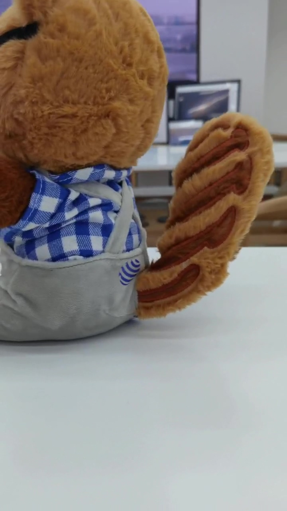
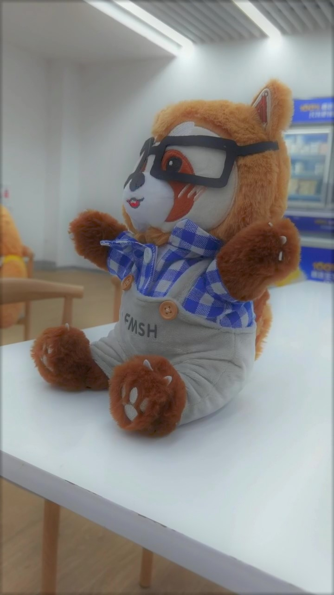
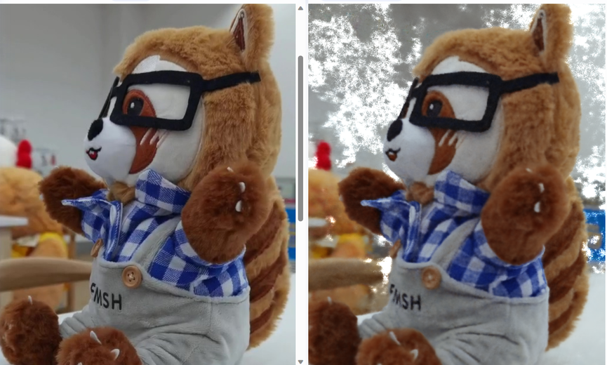
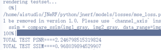
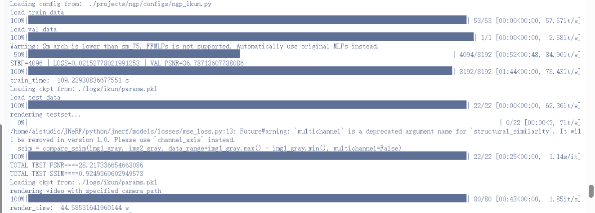
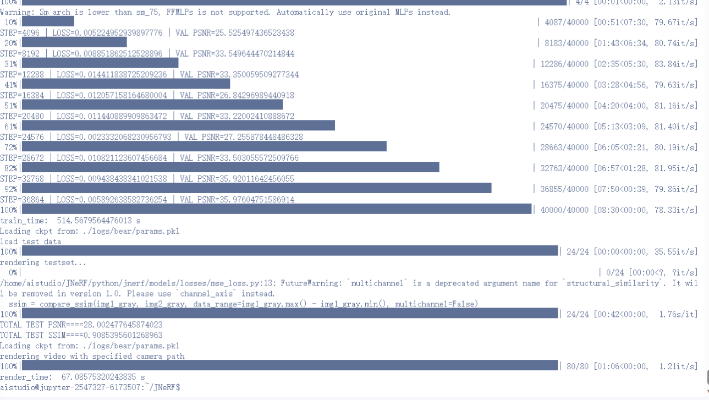
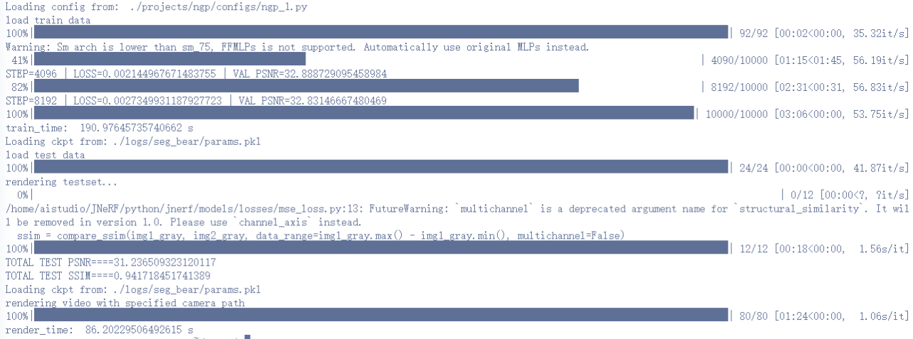

<font face="宋体">

&nbsp;
**<font size=12><p align="center">计算机图形学项目报告</p></font>**
&nbsp;
<font size=6><p align="center">Project3 【神经辐射场(NeRF)实践】 </p></font>
&nbsp;&nbsp;
&nbsp;&nbsp;

<div align=center></div>

&nbsp;&nbsp;&nbsp;&nbsp;
<font size=5>

&nbsp;
<center>
学生姓名：<u>叶兴松</u> 
    &nbsp&nbsp
学生姓名：<u>秦铮</u> 
</center>

&nbsp;
<center>
学&ensp;号：<u>20307130227</u> &ensp;
学&ensp;号：<u>20307130169</u> &ensp;
</center>

&nbsp;
<center>
专&ensp;业：<u>计算机科学与技术</u> &ensp;
专&ensp;业：<u>计算机科学与技术</u> &ensp;
</center>

&nbsp;
<center>
日&ensp;&ensp;期：<u>2023/06/xx</u>
</center>


</font>

### 一、基础部分：使用NeRF进行身边物体的重建

#### 概述

为了完成本次NeRF重建的任务，我们选取Instant-NGP作为重建方法。同时，我们使用百度飞桨AI平台来搭建环境，配置参数为（GPU：16G V100）。由于远程平台不支持实时渲染GUI的展示，以及Instant-NGP在该平台上的配置冲突，我们选用两套代码来进行重建：Instant-NGP源码由于实时渲染展示，JNeRF复现的Instant-NGP作为云端开发的代码。

在重建物体的选取上，我们先对ikun公仔进行了实拍和数据集的构建，尽管评测指标说得过去，但主观效果并不是很好。所以，我们再构建了一个bear玩偶的数据集，取得了较好的评测指标和主观效果。为了得到更好的效果，我们将bear的图片进行了图像分割的预处理，使PSNR这一指标超过了30这一基准线，且之前bear重建中出现的雾感被大大消减。

#### 所选方法介绍

##### Nerf方法：Instant-NGP


##### Nerf框架：JNeRF

JNeRF是由清华大学计算机图形学实验室基于自身计图(Jittor)框架开发的神经辐射场算法库，并在其中成功复现了Instant-NGP，故我们选取JNeRF作为我们的baseline用于身边物体的重建。

当前NeRF的主要训练流程总结为下图所示的7个模块。JNeRF框架集成度较高，仅需对数据处理做外部操作，训练流程则在内部一体化完成。

<div align=left></div>

Instant-NGP通过Hash编码和定制化的优化，其号称能在5秒训练出一个效果优质的结果。但经过JNeRF团队的分析，Instant-NGP的表现更可能是因为Nvidia针对硬件做了极致优化。同时，Instant-NGP的原始实现仍存在一些问题：

- 源码完全基于cuda编写，对习惯python的用户而言使用门槛较高，并且不同函数间耦合严重，难以修改。

- Instant-NGP没有成熟的深度学习框架支持，无法适配各种常用NeRF变种模型

- 环境搭建和本机编译困难，在自己的电脑和云上平台都上难以复现

基于以上问题，我们采用JNeRF实现的Instant-NGP，其优势有：

- 对现有的数据集（lego、fox）等做了完美的适配，方便我们直接通过数据对齐的方式制作我们的数据集，得到想要的训练和测试效果

- 环境配置方便，仅需下载`requirements.txt`中所需的库即可运行样例代码

- 训练和测试速度高效、效果优异。在飞浆AI平台提供的V100显卡上训练lego（100张训练集，主要超参设置为batch_size=4096、tot_train_steps = 40000、n_training_steps = 16）仅需约400s，且测试集的PSNR达到了36，SSIM达到0.98（如下图所示）

  <div align=left></div>
  
  渲染效果：
  
  <div style="display:flex;">
    <div>


#### 数据介绍

NerF重建3D模型基于来自同一物体不同角度2D的图片信息、摄像角度信息以及每张图片所对应的位姿数据信息。所以要使用NerF进行3D重建休要拍摄处理获得待建模物体的不同角度的图片，然后对图片进行匹配计算获得摄像角度和位姿数据信息。  

首先是获得同一物体不同角度的多张图片。考虑到精细的JNerF建模需要用到十几张甚至一百多张图片分别作为训练集、验证集和测试集，直接用手机进行拍摄照片的方式是复杂的。同时直接拍摄出来的图片之间的连贯性无法得到保障，这样3D重建的效果也会受到影响。

因此，我们采用围绕物体拍摄视频，然后将视频按照一定的频率裁剪出连续图片的方式来获得不同角度的多张图片。裁剪获得的图片可能存在有模糊，出界等问题，如果这些图片参与后续的3D重建会极大地影响重建效果，因此要对裁剪出来的图片进行挑选。

<div style="display:flex;">
  
  
</div>
处理得到不同角度的多张图片之后就需要根据这些连贯的图片计算出各张图片的位姿数据信息。我们计算图片位姿信息采用的是colmap函数工具。  

colmap函数库提供了一整套的提取特征、匹配、生成稀疏点云和进行捆绑调整的功能。首先，我们获取COLMAP数据库的路径，该数据库由图片集生成。如果要生成文本输出，则设置文本输出路径为数据库路径去掉扩展名并添加"\_text"后缀。然后，设置稀疏点云的输出路径为数据库路径去掉扩展名并添"\_sparse"后缀。运行COLMAP的特征提取命令，提取图像特征并将结果保存到数据库。

根据命令行参数设置匹配器类型，并运行COLMAP的特征匹配命令，执行图像特征的匹配。创建稀疏点云输出文件夹。运行COLMAP的稀疏重建命令，根据数据库中的特征和匹配结果生成稀疏点云。运行COLMAP的捆绑调整命令，对稀疏点云进行捆绑调整。创建文本输出文件夹。运行COLMAP的模型转换命令，将稀疏点云转换为文本格式输出。

``` python
def run_colmap(args):
	colmap_binary = "colmap"
	...
	db = args.colmap_db
	images = "\"" + args.images + "\""
	db_noext=str(Path(db).with_suffix(""))
	if args.text=="text":
		args.text=db_noext+"_text"
	text=args.text
	sparse=db_noext+"_sparse"
	...
	if os.path.exists(db):
		os.remove(db)
	do_system(f"{colmap_binary} feature_extractor --ImageReader.camera_model {args.colmap_camera_model} --ImageReader.camera_params \"{args.colmap_camera_params}\" --SiftExtraction.estimate_affine_shape=true --SiftExtraction.domain_size_pooling=true --ImageReader.single_camera 1 --database_path {db} --image_path {images}")
	match_cmd = f"{colmap_binary} {args.colmap_matcher}_matcher --SiftMatching.guided_matching=true --database_path {db}"
	...
	do_system(f"mkdir {sparse}")
	do_system(f"{colmap_binary} mapper --database_path {db} --image_path {images} --output_path {sparse}")
	do_system(f"{colmap_binary} bundle_adjuster --input_path {sparse}/0 --output_path {sparse}/0 --BundleAdjustment.refine_principal_point 1")
	...
	do_system(f"mkdir {text}")
	do_system(f"{colmap_binary} model_converter --input_path {sparse}/0 --output_path {text} --output_type TXT")
```
接着，读取相机参数文件，提取相机内参和畸变参数。循环读取每个相机的位姿信息，将其转换为旋转矩阵。将位姿信息保存到输出文件 transforms.json 中。
``` json
// 相机参数
"camera_angle_x": 0.6190827285169668,
    "camera_angle_y": 1.0352795225028297,
    "fl_x": 1125.6265409581058,
    "fl_y": 1123.9268724555845,
    "k1": -0.04825720120209138,
    "k2": 0.0902871681756544,
    "k3": 0,
    "k4": 0,
    "p1": -0.0028512053802142857,
    "p2": 0.001352324427509951,
    "is_fisheye": false,
    "cx": 360.4415575783281,
    "cy": 636.0227992875296,
    "w": 720.0,
    "h": 1280.0,
    "aabb_scale": 16,

// 图片位姿参数
"frames": [
        {
            "file_path": "./train/0012.jpg",
            "sharpness": 27.117056172169583,
            "transform_matrix": [
              [-0.6879948182957351,0.2952428937884938,-0.6629440125110266,-2.2990830148314387],
              [-0.7187466507538609,-0.15091573970488603,0.6786955809046147,2.6447392461789265],
              [0.10033136127671442,0.9434278314922152,0.3160340879855875,0.8453854547466939],
              [0.0,0.0,0.0,1.0]
            ]
          }
          ...
  ]
```
至此获得待建模物体的图片、相机信息和图片位姿信息，可以用于JNerF训练重建3D模型


#### 结果展示与评估

##### 主观结果展示

<div style="display:flex;">
  
  
  
</div>
**视频展示链接**：https://www.bilibili.com/video/BV1jP411X7JH


##### 数值评估

由于飞桨平台的Paddle框架与torch的不兼容，故这里只选取PSNR和SSIM这两个指标进行评估

| 重要超参/评估值  | ikun      | bear      | seg_bear  | lego(base) |
| :--------------: | --------- | --------- | --------- | ---------- |
|    batch_size    | 4096      | 4096      | 4096      | 4096       |
| tot_train_steps  | 8192      | 40000     | 10000     | 40000      |
| n_training_steps | 16        | 16        | 16        | 16         |
| background_color | [0, 0, 0] | [0, 0, 0] | [0, 0, 0] | [0, 0, 0]  |
|     **PSNR**     | 28.22     | 28.00     | 31.23     | 36.39      |
|     **SSIM**     | 0.92      | 0.91      | 0.94      | 0.98       |

以上的调参过程仅针对PSNR最优进行。但以bear为例，如果要使得SSIM更优，可尝试将background_color设置为[197,207,212]（桌子的颜色），获得的原图和生成图对比效果如下：

<div align=left></div>

获得的评测指标为：

<div align=left></div>

尽管PSNR仅为个位数，但SSIM已经接近0.97


##### 训练/渲染时间

以上面表格中的最优PSNR参数为准：

| 数据量\时间   | ikun  | bear  | seg_bear |
| ------------- | ----- | ----- | -------- |
| 训练集（张）  | 44    | 60    | 60       |
| 训练时间（s） | 109.2 | 514.6 | 191.0    |
| 渲染时间（s） | 44.6  | 67.1  | 86.2     |


##### 运行结果截图

ikun数据集：

<div align=left></div>

bear数据集：

<div align=left></div>

seg_bear数据集：

<div align=left></div>


### 二、扩展部分：NeRF探索性研究


### 文件说明


### 参考

1. [NVlabs/instant-ngp (github.com)](https://github.com/NVlabs/instant-ngp)
2. [Jittor/JNeRF (github.com)](https://github.com/Jittor/JNeRF)
3. [Jittor开源: JNeRF带你5秒训好NeRF](https://cg.cs.tsinghua.edu.cn/jittor/news/2022-06-01-12-52-00-00-jnerf/)

</font>

